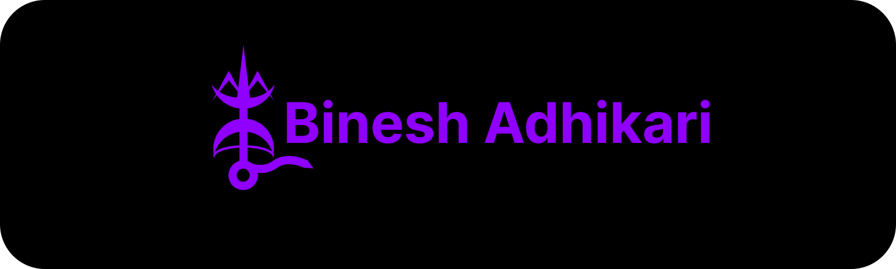

# Binesh Adhikari
## Come one Come all
Hi! Welcome. Myself Binesh Adhikari, you can call me BinatoDrkLight aka Binato. This is my github profile and I upload projects and academic contents over here. I have learnt lots of stuffs throught out my journey. I have explored through  a lot of different programming languages but I have chosen to follow MERN stack currently. While I'm not at technology, I like doing extra activities such as playing chess, guitar, making origami, drawing, gaming, watching anime.

# Portfolio
Portfolio : [binatodrklight.com.np](https://bineshadhikari.com.np)

# Tech Stack

    
    
    
    
    
    
    
    
    
    
    
    
    
    
    
    
    
    
    

# Projects
I have done some projects but the ones that I would to showcase are as follows:
## Planty - Plant Ecommerce System
Planty is a web-based plant store built with the MERN stack, TailwindCSS, enabling users to discover and purchase plants online while allowing sellers to manage products and orders efficiently. The platform features a responsive design and showcases modern web development techniques, secure payments, and database-driven functionality.
Repository: binatodrklight/ProjectIIBCA6thSem | Live Demo: https://planty-smoky.vercel.app

## Trackie - Bus Tracking System
Trackie is a simple bus tracking system built using PHP, Leaflet.js, JavaScript. It allows users to track buses in real-time, plan their arrival at bus stops efficiently, and helps drivers share their live location with passengers.
Repository: binatodrklight/ProjectIBCA4thSem | Live Demo: https://trackie.is-great.net

# Contacts
  <a href="https://linkedin.com/in/bineshadhikari-it" style="text-decoration:none; color:inherit;">
     linkedin/in/bineshadhikari-it
  </a> 
  
  <a href="mailto:youremail@gmail.com" style="text-decoration:none; color:inherit;">
     binesh2adhikari@gmail.com
  </a>

# GitHub Stats

#### <i>- In case I don’t see ya, good afternoon, good evening, and good night.</i>

